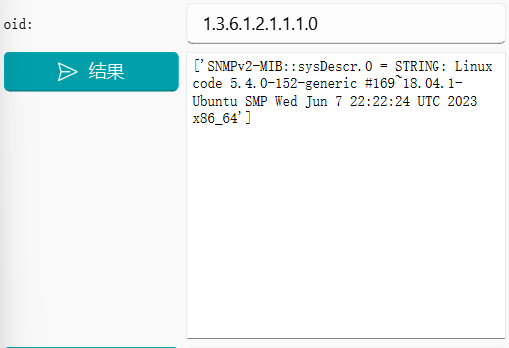
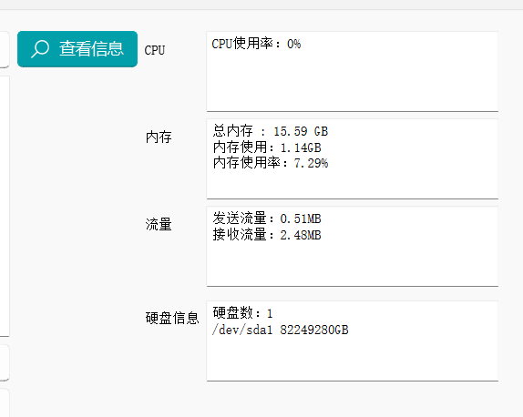
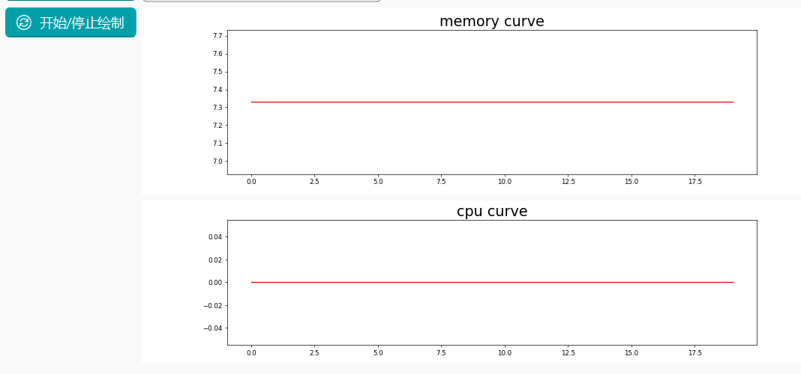
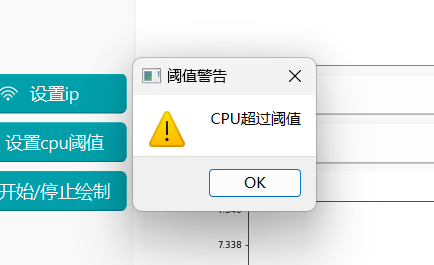
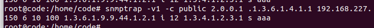
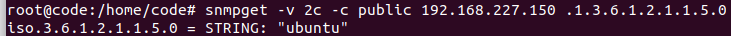
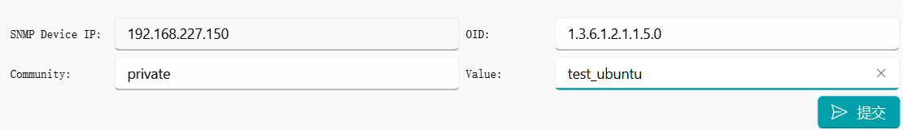
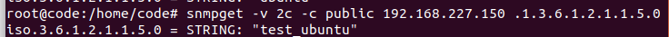

# 基于SNMP的系统监控与分析

## 相关配置

- requirements.txt：用conda创建python=3.11的虚拟环境，然后运行`pip install -r requirements.txt`

- snmpwalk安装

## 功能测试

从mysnmp.py进入程序：

设置ip：

输入oid返回结果：

点击查看信息可返回对应ip主机的CPU、内存、硬盘空间、流量值：

设置cpu阈值：

绘制曲线:

超过阈值弹窗：

snmptrap：测试前需要将snmp陷阱停止

在虚拟机输入命令：

可以看到接收到如下信息：

snmpset：

虚拟机字段初始值：

提交如下命令：

再次查看：

